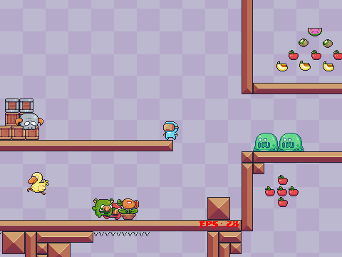
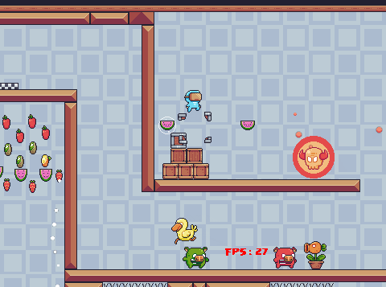
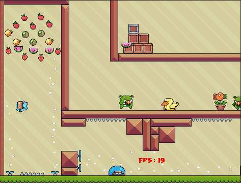
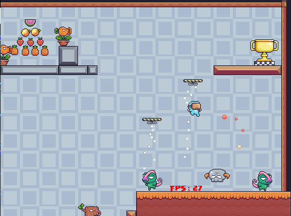

# Tiles Adventure
Platformer game written in C++.
I used [Tiled](https://www.mapeditor.org/) for the map creation and objects positioning.

## Dependencies
 - [SDL-1.2.15](http://www.libsdl.org/) for rendering.
 - [libtmx](https://github.com/baylej/tmx) for map loading. libtmx needs : 
 	- libxml2 to parse the tmx file.
 	- zlib-1.2.3 to decompress tmx file. <em>Optional</em>, because the map file can be exported uncompressed.

## Screenshots
<table>
	<tr>
		<td></td>
		<td></td>
	</tr>
	<tr>
		<td></td>
		<td></td>
	</tr>
</table>